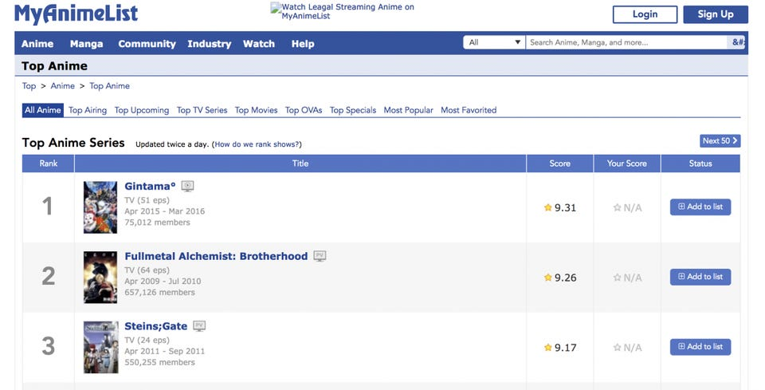

# Group 12 - My Anime List Analysis

**Please remember to update this section**

- Your title can change over time.

## Milestones

Details for Milestone are available on Canvas (left sidebar, Course Project).

## Describe your topic/interest in about 150-200 words

**Please remember to update this section**

All three of us watch anime often and are generally curious about what animes are the most popular and highest rated. Some interesting points we considered looking into include:
 - If there is any correlation between the source material of an anime (light novel, manga, original) and it's rating and popularity and also which studios have the most popular and highest rated animes.
 - Correlation between media type (tv/movie/ova), number of episodes, and date of release to the popularity of the anime.
- Measure and compare relationship between number of episodes the show has and how highly rated the show is, as well as which genre of anime is most/least highly rated.
The main goal of our analytics project is to satisfy our curiousity, and to also see if there are any trends that an anime studio could use when deciding an anime to produce next in order to ensure success. It would also be cool to have this data shown in a dashboard for other people to access and browse.
## Describe your dataset in about 150-200 words

**Please remember to update this section**

The company that provides our data is MyAnimeList Co.Ltd which provides us with data that shows user review scores, genres, popularity ratings(views, ratings out of 10), media type, origin of adaptation, premiere date, and anime studios  among other statistics collected in 2020. The purpose of our dataset is for fun and public interest, as a lot of people enjoy looking at popular anime lists to decide what to watch next and see how their favourite anime compares to other animes. It also helps predict which animes will be the most popular each season (Spring, Summer, Fall, Winter) and also provides the general public with extensive information on each anime provided in the dataset. The data was originally compiled on MyAnimeList's website, with statistics such as premiere date and genre being provided by the site itself, and ratings and reviews provided by the site's users. The data was then put into our dataset using python code to read from the website.

## Team Members

**Please remember to update this section**

- Eddy: 2nd year BA comp sci that loves isekai anime.
- Justin: 3rd year Human Kinetics student that loves anime in general and is interested in the world of coding.
- Person 3: one sentence about you!

## Images

**Please remember to update this section and remove the test image!**

## References

**Please remember to update this section**

Image source: https://imageio.forbes.com/blogs-images/laurenorsini/files/2018/05/Screen-Shot-2018-05-30-at-9.32.33-AM-1200x611.jpg?format=jpg&width=960

Dataset source: https://www.kaggle.com/datasets/hernan4444/anime-recommendation-database-2020?select=anime.csv

