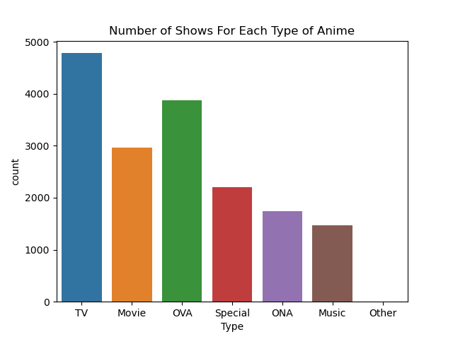

# Introduction

All three of us watch anime often and are generally curious about what animes are the most popular and highest rated. Some interesting points we considered looking into include:
 - If there is any correlation between the source material of an anime (e.g. light novel, manga, original), and it's rating and popularity.
 - Correlation between media type (e.g. TV/movie/OVA) and amount of full completions to the popularity of the anime.
- Measure and compare relationship between number of episodes the show has and how highly rated the show is, as well as see how the other variables are impacted by number of episodes.

The main goal of our analytics project is to satisfy our curiousity, and to also see if there are any trends that an anime studio could use when deciding on an anime to produce next in order to ensure success. Our dataset was provided by [Hernan Valdivieso on kaggle](https://www.kaggle.com/datasets/hernan4444/anime-recommendation-database-2020?select=anime.csv), who in turn compiled their data from [MyAnimeList](https://myanimelist.net/).
___
# Exploratory Data Analysis

**EDA Fig.1: A heatmap of the correlation between the various numerical variables included in our dataset.**

>As a lower popularity and ranked score is actually better, any negative correlation for these is actually positive.

>Interesting to note here is that there's a negative correlation between popularity and the total amount of anime completions. As expected though, the more popular an anime is, the more people plan to watch it, and popular animes correlate somewhat with high scores. Funnily enough, there is a slight correlation between how long an anime is and how many people have it on hold or have dropped it (presumably because it was too long).

**EDA Fig. 2: A bar chart of the total amount of animes per type.**

>The countplot above shows the amount of anime produced for each category. TV has by far the most amount of shows, with OVAs and movies in second and third, respectively. TV being in the lead makes sense as when one thinks of an anime, they would most likely think of an episodic TV one. 

**EDA Fig. 3: A bar chart of the total amount of animes for each rating from 1-10.**

Something that should be questioned in our analysis is:
>*"What is the general score people usually give to a show?"* 

>It looks like the average anime gets scored around 6.5 to 7.5, with exceedingly few being scored below 5 or above 9. This is important to contextualize the rating system on MyAnimeList, and shows that any anime with a score below 5 is likely extremely bad and should be avoided, while animes with a score above 9 stand out by a large amount in a good way and are likely worth watching.

**EDA Fig. 4: A boxplot of average scores on MyAnimeList**

>This boxplot further explains Fig. 3 and demonstrates again that people rarely tend to give a score of 9 or above **(notice the outliers)**. There are an abundant amount of outliers with low scores around 4 (Minimum). That is proof that more people tend to give a show a very low score (assume below 4) if they're **dissastified** with it rather than give a **very satisfactory** show (assume 9+) a very high score.

>The Median being between 6-7 correlates with what is seen in Fig. 3 and also shows that even though the scale is from 1-10. People usually do rate a show *slightly higher* than the middle of the range (which is 5)

NOTE THAT:

|Range | Description |
|------|-------------|
|MINIMUM| 4 |
|LOW OUTLIERS | Below 4 |
|LOWER QUARTILE| 6 |
|MEDIAN |6 to 7 |
|UPPER QUARTILE |7 to 9 |
|UPPER OUTLIERS  |Above 9 |
|MAXIMUM |9 |

**EDA Fig. 5:  A histogram of the ratings given to animes by their episode count** 

>The histogram displays the message that for a show to have a high user-provided score, it NEEDS to have a substantial amount of Episodes. Notice how the Score *escalates* till the range of 6-7  and then starts *deviating*. The **peak is 1750+** episodes where the score is around 6.5.

>It should be noted that theres very few shows with a high (6+) rating that have less amount of episodes. But theres a lot of shows with less than **roughly 100 episodes** that have a very low score.
---

# Justin's Research: 

>**Question 1: Is there a correlation between an animes popularity and its number of full completions?**

>**Question 2: What are the most popular types of anime based on their popularity rating?**

**Figure 1**

>This graph above shows a barplot of the average popularity for each type of anime. Here, we can see that on average, TV is the most popular type of anime, as the lower the popularity score is, the better the rating. Other is in second place for popularity, with special and OVA in third and fourth respectively. Movie is the 5th most popular, ONA behind it in 6th, and music being the least popular type on average. 

**Figure 2**

>This scatterplot above shows the relationship between average popularity and average full anime completions for each type of anime. We can see in this plot that TV has the most full completions and highest popularity score. If a line of best fit were to be drawn here, we could see that in general, as popularity decreases (higher rating), we see more full anime completions. This indicates that there is a positive correlation between popularity and full anime completions.

**Figure 3**

>This heatmap above shows the actual correlation between full anime completions and popularity. We can see that popularity has a correlation of -0.38 with full completions, indicating a positive correlation (The lower popularity rating, the better) between popularity and full anime completions.

### **Is there a correlation between an anime's popularity and its number of full completions?**

In figure 2, we can see that there is a slight positive correlation (remember, lower popularity is better), but not much of one between popularity and full anime completions. Figure 3 shows us that there is a very slight correlation (n=-0.38). It's important to note that although this correlation represents a negative number, it's actually a positive correlation, due to the fact that a lower popularity number indicates a higher popularity. 

### **What are the most popular types of anime based on their popularity rating?**

We can see that on average, TV type animes are the most popular (lower popularity number = more popularity), then other, special, and OVA. One important thing to note here is that the data range for 'Other' only has an average of 1.67 completions, which may cause a skew in the data since there are less completions to give a popularity rating, backed up by EDA figure 2 where you see hardly any representation for the 'Other' category. TV has the highest representation by far, which could be an indicator that because TV shows are popular, more are being made in comparison to other types of anime.

[Click here for the full analysis notebook, including code and data](https://github.com/ubco-W2022T1-cosc301/project-group12/blob/main/notebooks/analysis1.ipynb)

# Eddy's Research: 
> **Question 1: Is there a correlation between an anime's source material and it's average rating?**

> **Question 2: Is there a correlation between an anime's source material and how popular it is?**

**Figure 1**

> This box plot shows that light novels are the most well-rated by a small margin on average compared to manga adaptations, and a fairly large margin compared to anime originals. Interestingly, there are no light novels with a score above 9, but a fair amount of manga with a score above 9. This could mean that there aren't any super amazing, stand out light novel adaptations, but generally they will be good. Digital manga adaptations are the worst rated on average by far.

|Source | Average Score |
|------|-------------|
|Light novel|    7.108735|
|Manga        |    7.048943|
|Novel         |   6.929943|
|Web manga      |  6.888144|
|4-koma manga    | 6.795022|
|Book            | 6.751923|
|Visual novel     |6.686997|
|Original       |  6.646078|
|Game            | 6.521658|
|Card game        |6.417963|
|Other            |6.408939|
|Picture book     |6.398261|
|Music            |6.340517|
|Radio            |6.006000|
|Digital manga    |5.618889|

> This table makes the averages much more clear, as with Figure 1, light novel adaptations on average have the highest score followed by manga adaptations, followed, surprisingly, by novel adaptations.

**Figure 2**

>This box plot shows that light novel adaptations are the most popular on average by a very significant margin, with picture book adaptions being the least popular.

|Source | Average Popularity |
|------|-------------|
|Light novel    |  2312.66|
|Visual novel   |  3481.22|
|Web manga      |  4049.98|
|Manga          |  4076.60|
|4-koma manga   |  4517.24|
|Digital manga  |  5138.44|
|Game           |  5349.96|
|Original       |  5712.85|
|Other          |  5893.44|
|Novel          |  5915.54|
|Card game      |  6070.00|
|Radio          |  7053.00|
|Book           |  7199.12|
|Music          |  8000.40|
|Picture book   |  8920.74|

>Another table to more clearly show the average popularity of each source material type.
Light novels are overwhelmingly the most popular on average, followed by visual novels and various forms of manga.
Web manga adaptations seem to be the most popular on average by a small amount, with digital manga being the least popular. The 3 least popular adaptations are books, music, and picture books.

**Is there a correlation between an anime's source material and it's rating?**

As seen in figure 1, there is a clear correlation between an anime's source material and it's average rating. Light novel adaptions seem to be the most well received by a small margin, followed by manga adaptations and full length novel adaptations. Music, radio, and digital manga adaptations respectively are the 3 worst-rated on average.

**Is there a correlation between an anime's source material and popularity?**

As seen in figure 2, there is also a clear correlation between an anime's source material and how popular it is. On average, light novel adaptions are vastly more popular than any other source material, followed by visual novel adaptations and adaptations of various forms of manga. On the other hand, book, music, and picture book adaptations respectively are the 3 least popular.

Note that light novel adaptations are on average both the most popular and highly rated forms of anime. Perhaps if an anime studio wishes to create an anime that will be both popular and well-rated, they should prioritize adapting a light novel.

[Click here for the full analysis notebook, including code and data](https://github.com/ubco-W2022T1-cosc301/project-group12/blob/main/notebooks/analysis2.ipynb)

# Tanay's Research

> **Question 1: Is the user given score rating affected by the number of episodes?**

> **Question 2: Do other variables also get impacted by the volume of episodes a show has?**
### **INTRODUCTION TO QUESTION**

>MyAnimeList has a score system that users can utilize to rate their favorite shows. The ratings work from 1-10 (shown below)

>A sample rating of a medium can look like this:

Since there a lot of other variables except score, I wanted to examine if these variables had a significant impact on each other especially if they had an impact on number of episodes as well. As such, The visualizations below display the results

---

### **VISUALIZATIONS**

1. *CIRCLE PLOT*

> This circle plot demonstrates how the number of Episodes has an impact on the Status of the show. On the website, users are able to mention if they have either: 
- finished the show
- dropped it
- plan to watch it
- kept it on hold.

> I wanted to notice if there was a correlation between these factors and the show's episode amount.

> Sure enough, there was a correlation! On the first graph you can notice that as long as the show has 150+ episodes , most people on average tend to **finish the whole show** but eventually as there are more and more episodes, the average amount of people who finish the show keep dropping **(ORANGE CIRCLE)**

> At one point when there are more than 450+ episodes, the amount of people who wish to do all four things *(watch/drop/plan to watch/finish)* are the same. So this answers my question that the status of the show does get affected both **positively and negatively** by the amount of episodes.

---

2. *DUAL BAR GRAPH*

>What I found interesting about this dual chart is the contrast between the relation of Scores to Average Episodes and Maximum Episodes respectively.

2.1 *Average Episodes to Score*

> For a show to have a rating below the mean which is precisely 6.235, it **NEEDS** to have below 54 episodes on average (check figure 2.12). Meanwhile, as you can see that there are tons of shows that exceed 100+ episodes and achieve a higher user score. Of course there are outliers for high scores as well with few episodes.

*Figure 2.12*

>But the same cannot be said for low rated shows. This proves that shows with sufficient episodes have a higher tendency of obtaining good scores than shows with minimal episodes.

2.2 *Max Episodes to Score*

> When compared to the figures above, this graph does tend to display more variety in it's values since this is comparing Maximum episodes to the Score. So there's a lot more values with individuality and obviously---**more outliers!**

>However in this graph, one can easily detect that there's actually quite many shows with lots of episodes **(1000+)** with low ratings. So while episodes and scores tend to have a positive /upward relationship in most cases there are always exceptions. But once again shows with scores below 5.0 are displaying signs of very low episodes.

## Do these visualizations answer my Research Question?

>### *Question 1. (Is the user given score rating affected by the number of episodes?)*

Yes, the user score is *heavily affected* by the number of episodes the number of show has. The dual bar chart clearly explains that above by demonstrating how short shows tend to have user ratings on the lower end of the scale in most cases while long ongoing shows with **triple digit +** episodes tend to have higher scores!

>### *Question 2. (Do other variables also get impacted by the volume of episodes a show has)*

Of course, variables such as the current status of the show that people keep on the website also drastically depends on the number of episodes. The circle plot shows how people tend to finish a show completely if it has less episodes but as the show gets longer and longer people lose interest and don't keep up. So yes other variables also have a noticeable relationship with episodes

[Click here for the full analysis notebook, including code and data](https://github.com/ubco-W2022T1-cosc301/project-group12/blob/main/notebooks/analysis3.ipynb)

# Conclusion

To summarize, we found that 
